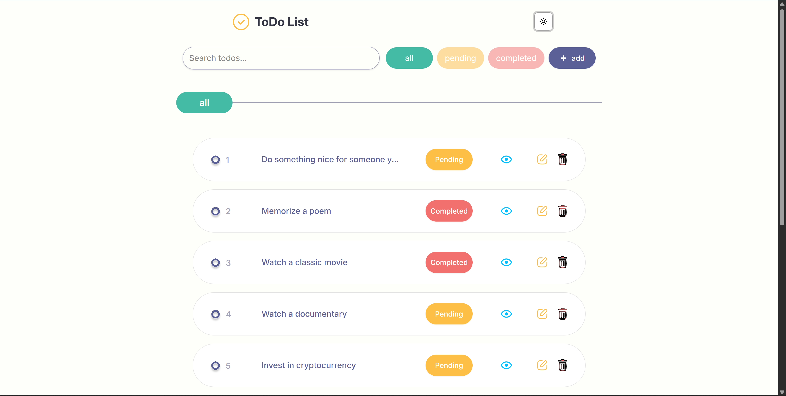

# 📝 React Todo App

A beautiful and performant Todo List application built with modern frontend tools including React, TanStack Query, Zustand, and Tailwind CSS. It features CRUD operations, pagination, filtering, modals, and local persistence.

## 🚀 Features

- ✅ Create, read, update, and delete todos
- 🔍 Search and filter todos by status (All, Completed, Pending)
- 📄 Pagination support
- 💾 Syncs with localStorage for offline persistence
- 🎨 Beautiful UI with Tailwind CSS and ShadCN components
- 🧱 Uses TanStack Query for efficient data fetching
- ⚠️ Built-in error boundary for runtime error testing
- 🔄 Skeleton loaders while data is loading


## 🧱 Tech Stack

| Category       | Technology / Library                                |
|----------------|-----------------------------------------------------|
| **Framework**  | [React](https://reactjs.org/)                       |
| **State Mgmt** | [Zustand](https://github.com/pmndrs/zustand)       |
| **Data Fetch** | [TanStack Query](https://tanstack.com/query/latest)|
| **Routing**    | [React Router v7](https://reactrouter.com/)        |
| **Styling**    | [Tailwind CSS](https://tailwindcss.com/)           |
| **UI Kit**     | [ShadCN UI](https://ui.shadcn.com/)                |
| **Icons**      | [Iconify](https://iconify.design/)                 |
| **HTTP Client**| [Axios](https://axios-http.com/)                   |
| **Package Mgr**| [pnpm](https://pnpm.io/)               |


## 📦 Installation

### 1. Clone the Repository
```bash
git clone https://github.com/your-username/react-todo-app.git
cd react-todo-app
```
### 2. Install Dependencies
```
pnpm install
```
---

## 🧪 Running the App Locally
```bash
pnpm dev
# or
pnpm run dev
```
Visit http://localhost:5173 in your browser.

---

## ⚒️ Available Commands
```
pnpm dev         # Run app in development mode
pnpm build       # Create production build
pnpm preview     # Preview production build locally
```

---

## 🖼️ Screenshots




## 📌 Todos

- [x] Pagination
- [x] Search & Filter
- [x] LocalStorage Persistence
- [x] CRUD (Create, Read, Update, Delete)
- [x] State Management with Zustand
- [x] Error Handling
- [ ] Real Authentication (Planned)
- [ ] Real Backend (Planned)


## 🧠 Future Improvements

- Add login/register with JWT

- Store todos to database (e.g., Firebase, Supabase, or custom API)

- Add drag-and-drop sorting

- Dark/light theme toggle


## 🧑 Author

Agbor Reuben Gift

- GitHub: [@Reuben-10](https://github.com/Reuben-10)

- AltSchool Africa


